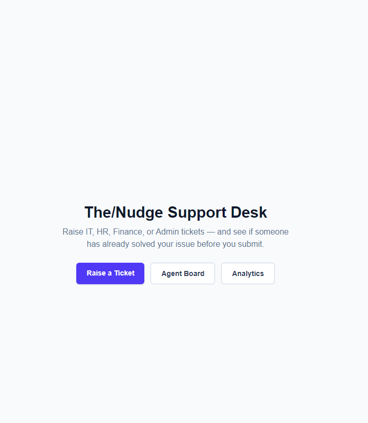
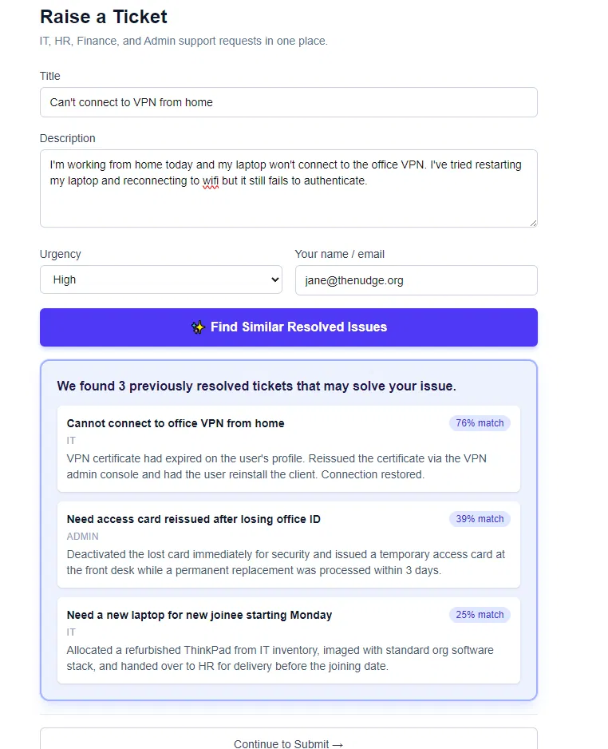
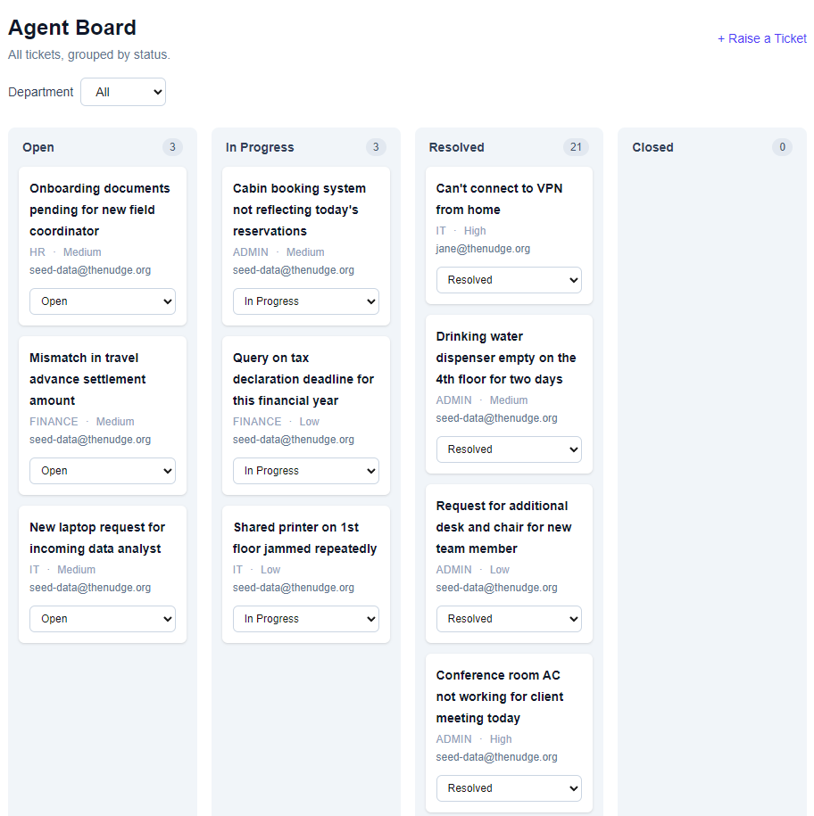
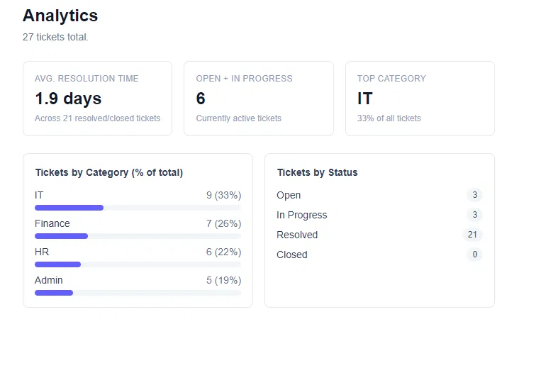

# The/Nudge Ticketing Tool

An internal IT/HR/Finance/Admin support ticketing tool built for The/Nudge Institute's AI Product Engineer take-home. The core idea: the AI layer is designed to prevent tickets from being created, not just to process them faster — before an employee submits a ticket, they see the top 3 previously resolved tickets that look similar to their problem.



See [`Overview.md`](Overview.md) for the full architecture write-up and design decisions.

## Live deployment

- Frontend (Vercel): https://nudge-flax.vercel.app/
- Backend (Render): https://nudge-ticketing-backend.onrender.com/docs

The Render free-tier instance sleeps after 15 minutes of inactivity — the first request after idle may take 30–60s to wake up.

## How It Works

### Find Similar Resolved Issues

The core differentiator: before a ticket can even be submitted, the tool searches previously resolved tickets and surfaces close matches, preventing duplicate tickets from being created in the first place.



### Agent Board & Lifecycle

A four-column board (Open / In Progress / Resolved / Closed) tracks ticket lifecycle, with a hard gate requiring resolution notes before a ticket can move to Resolved or Closed.



## Analytics

Tracks ticket count by category and status, average resolution time, and the percentage breakdown of recurring issue categories.



## Tech stack

- **Backend:** FastAPI + SQLAlchemy, deployed on Render
- **Database:** Supabase Postgres with `pgvector`
- **Embeddings:** `sentence-transformers/all-MiniLM-L6-v2`, run server-side via `fastembed` (ONNX runtime), loaded once at startup
- **Categorization:** Claude (`claude-sonnet-4-6`), single structured tool-use call returning `{category, confidence, reasoning}`
- **Frontend:** Next.js + TypeScript + Tailwind, deployed on Vercel

## Repo layout

- [`backend/`](backend/) — FastAPI app, SQLAlchemy models, seed/retrieval scripts (`scripts/`)
- [`frontend/`](frontend/) — Next.js app (ticket raising flow, agent board, analytics)

## Local setup

### Backend

```bash
cd backend
python -m venv venv
venv\Scripts\activate          # or source venv/bin/activate on macOS/Linux
pip install -r requirements.txt
cp .env.example .env           # fill in DATABASE_URL (Supabase session pooler) and ANTHROPIC_API_KEY
python -m scripts.seed         # seeds 20 resolved tickets with embeddings
python -m scripts.seed_extra_open   # adds a few Open/In Progress tickets
python -m scripts.test_retrieval    # standalone similarity-search sanity check
uvicorn app.main:app --reload
```

Backend runs at `http://localhost:8000` (`/docs` for the Swagger UI).

### Frontend

```bash
cd frontend
npm install
echo "NEXT_PUBLIC_API_URL=http://localhost:8000" > .env.local
npm run dev
```

Frontend runs at `http://localhost:3000`.
